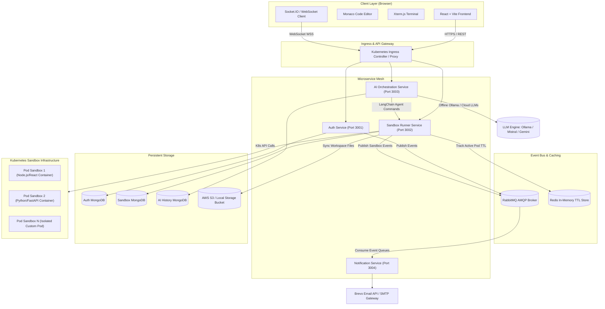
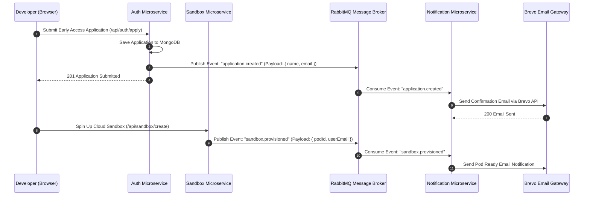
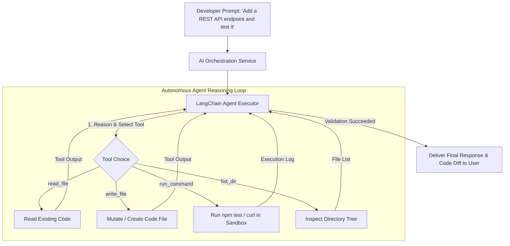

# 🏗️ INKz — System Architecture & Technical Deep Dive

Welcome to the internal system architecture and engineering documentation for **INKz** — a high-performance, event-driven **Cloud IDE & Agentic AI Platform**.

This document covers the end-to-end technical mechanics of how INKz orchestrates microservices, provisions isolated Kubernetes container pod sandboxes, manages Redis TTL lifecycles, handles RabbitMQ event messaging, mirrors S3 workspace files, and executes multi-file AI coding agents.

---

## 📐 System Architecture Diagram



---

## 🧩 Microservices Deep-Dive

INKz is built on a decoupled, cloud-native microservice architecture where each service operates as an independent node inside Kubernetes.

```
┌─────────────────────────────────────────────────────────────────────────────┐
│                              INKz MICROSERVICES                              │
├───────────────────┬───────────────────┬───────────────────┬─────────────────┤
│    auth-service   │  sandbox-service  │   ai-service      │ notification-svc│
│   (Auth & JWT)    │ (K8s & S3 Runner) │(LangChain Agent)  │(RabbitMQ Email) │
└───────────────────┴───────────────────┴───────────────────┴─────────────────┘
```

### 1. Auth Microservice (`auth`)
- **Port:** `3001`
- **Tech Stack:** Node.js, Express, Passport.js, JWT, MongoDB
- **Responsibilities:**
  - Handles Google OAuth 2.0 authentication (`/api/auth/google`).
  - Issues secure HTTP-only JWT cookies for stateless session verification (`/api/auth/me`).
  - Manages early access cloud applications (`POST /api/auth/apply` & `GET /api/auth/my-application`).
  - Emits `USER_REGISTERED` and `APPLICATION_SUBMITTED` events to RabbitMQ.

### 2. Sandbox Microservice (`sandbox`)
- **Port:** `3002`
- **Tech Stack:** Node.js, Express, `@kubernetes/client-node`, `@aws-sdk/client-s3`, `node-pty`, Redis, Socket.IO
- **Responsibilities:**
  - **Kubernetes Pod Provisioning:** Communicates directly with the Kubernetes API server to spawn isolated container pods (`inkz-sandbox-<id>`).
  - **Pod Resource Management:** Enforces hard CPU (`500m` - `2000m`) and Memory (`512Mi` - `2Gi`) cgroup limits per developer workspace.
  - **Interactive PTY Shell:** Spawns `node-pty` pseudo-terminals inside pods and pipes bi-directional stdin/stdout over WebSockets.
  - **Dynamic Port Forwarding Proxy:** Dynamically routes HTTP traffic from `http://localhost:<dev_port>` to the developer's live running container app.
  - **AWS S3 File Mirroring:** Watches local workspace filesystem mutations and streams debounced file diffs to AWS S3 buckets (with automated fallback to local disk storage if AWS keys are omitted).

### 3. AI Orchestration Microservice (`ai-orchestration`)
- **Port:** `3003`
- **Tech Stack:** Node.js, LangChain, Mistral AI, Ollama API, Google Gemini, OpenAI, MongoDB
- **Responsibilities:**
  - **Agentic Execution Loop:** Runs autonomous LangChain agents that reason over user instructions, plan multi-file code modifications, and execute terminal debugging commands.
  - **Built-in Agent Tools:**
    - `read_file`: Inspects target workspace source code.
    - `write_file`: Modifies existing code files or creates new assets.
    - `run_command`: Executes terminal build & test commands inside the sandbox pod.
    - `list_dir`: Inspects project directory structures.
  - **Dual Provider Engine:**
    - **Offline Local AI:** Connects to local **Ollama** instance (`http://localhost:11434`) running `qwen2.5-coder:7b`, `mistral:7b-instruct`, or `llama3:8b`.
    - **Cloud AI:** Connects to **Mistral AI**, **Google Gemini**, **OpenAI**, **DeepSeek**, or **Claude**.
  - **Conversation Persistence:** Stores chat history, agent tool invocations, and code diff logs in MongoDB.

### 4. Notification Microservice (`notification`)
- **Port:** `3004`
- **Tech Stack:** Node.js, RabbitMQ (`amqplib`), Brevo API (Sendinblue), nodemailer
- **Responsibilities:**
  - Consumes AMQP channels from RabbitMQ asynchronously.
  - Triggers transactional notification emails for:
    - Early Access Cloud Application Approvals
    - Pod Boot Status Alerts
    - Security Login Confirmations

---

## ⚡ Event-Driven Architecture with RabbitMQ

INKz uses **RabbitMQ** as an AMQP message broker to maintain asynchronous event decoupling across microservices.



---

## 🔄 Redis TTL Sandbox Pod Lifecycle & Heartbeats

To prevent resource exhaustion on Kubernetes clusters, INKz implements a strict **Redis-backed TTL lifecycle management system**:

```
                       ┌─────────────────────────────────────┐
                       │  Developer Connects to Workspace    │
                       └──────────────────┬──────────────────┘
                                          │
                                          ▼
                       ┌─────────────────────────────────────┐
                       │ Pod Provisioned in Kubernetes Cluster│
                       └──────────────────┬──────────────────┘
                                          │
                                          ▼
                       ┌─────────────────────────────────────┐
                       │ Redis Key Created:                  │
                       │ 'sandbox:ttl:<pod_id>' (TTL: 900s)  │
                       └──────────────────┬──────────────────┘
                                          │
                  ┌───────────────────────┴───────────────────────┐
                  │                                               │
                  ▼                                               ▼
      [Developer Active]                                 [Developer Inactive]
Heartbeat sent every 30s                             No heartbeat received for 15 mins
Redis TTL reset back to 900s                         Redis TTL expires (Key evicted)
Pod remains ALIVE                                    Redis Key Expiration Trigger Event
                                                                  │
                                                                  ▼
                                                     ┌─────────────────────────┐
                                                     │ K8s API Deletes Sandbox │
                                                     │ Pod & Frees Cluster RAM │
                                                     └─────────────────────────┘
```

1. **Pod Provisioning:** When a developer launches a workspace, Sandbox Service sets a Redis key `sandbox:ttl:<pod_id>` with a **15-minute expiration (900 seconds)**.
2. **Client Heartbeats:** While the developer keeps the tab open, the browser sends background heartbeats (`POST /api/sandbox/heartbeat`). Every heartbeat resets the Redis key TTL back to 900 seconds.
3. **Automated Expiration Cleanup:** If the developer closes their browser tab or disconnects, the heartbeat stops. After 15 minutes of inactivity, Redis evicts the key and triggers an expiration event listener. The Sandbox Service immediately calls `k8sApi.deleteNamespacedPod()`, terminating the container and reclaiming cluster memory.

---

## 🪣 Persistent File Sync: S3 & Local Disk Fallback

Workspace state is completely decoupled from ephemeral Kubernetes pods:

```mermaid
flowchart LR
    Browser["Monaco Editor (Client)"] -->|Socket.IO File Change| SandboxServer["Sandbox Service"]
    SandboxServer -->|Write Local Container FS| PodContainer["Pod Workspace (/workspace)"]
    SandboxServer -->|Debounced Mirror (500ms)| SyncEngine["Storage Sync Engine"]
    
    SyncEngine -->|AWS Credentials Provided?| Choice{AWS Configured?}
    Choice -->|Yes| S3Bucket[("AWS S3 Persistent Bucket")]
    Choice -->|No (Local Dev)| LocalDisk[("Local Storage Directory (/data/workspaces)")]
```

- Every code edit in the Monaco Editor is transmitted over Socket.IO to the Sandbox Service.
- The file is instantly written to the live container pod filesystem.
- The **Storage Sync Engine** debounces file writes and pushes the update to **AWS S3** or **Local Disk Storage**.
- When a pod is deleted due to TTL expiration, all files remain 100% safe in persistent S3/Local storage and are re-attached instantly when the user re-opens their workspace.

---

## 🤖 Agentic AI Pipeline with LangChain

INKz integrates an autonomous AI coding agent capable of understanding entire codebases:



---

## 🐳 Kubernetes Local Skaffold vs Cloud AWS EKS

INKz is designed for seamless transition between local development and cloud production:

| Deployment Component | Local Development (`skaffold dev`) | Production Cloud (`skaffold-eks.yml`) |
|---|---|---|
| **K8s Cluster** | Docker Desktop / Minikube | AWS EKS (Elastic Kubernetes Service) |
| **Container Registry** | Local Docker Daemon | AWS ECR (Elastic Container Registry) |
| **Ingress** | NGINX Ingress Controller | AWS ALB (Application Load Balancer) Controller |
| **AI Backend** | Ollama (`qwen2.5-coder:7b`) | Mistral AI / Gemini 1.5 Pro |
| **File Persistence** | Local Disk Storage | AWS S3 Bucket |

---

## 🔒 Security & Sandboxing Isolation

1. **Container Isolation:** Every developer workspace runs inside its own isolated Kubernetes namespace and pod sandbox with unprivileged container user policies.
2. **Network Policies:** Pod-to-pod cross-talk is blocked by Kubernetes NetworkPolicies. Pods can only communicate with the Sandbox Gateway.
3. **Resource Limits:** Hard Memory & CPU limits prevent memory leak attacks or rogue process resource exhaustion (`limits: memory: "2Gi", cpu: "2000m"`).
4. **Session Security:** All authentication tokens are delivered via `HttpOnly`, `SameSite=Lax`, `Secure` cookies to eliminate XSS token theft.

---

## 👨‍💻 Author & Architecture Credits

Designed and Engineered by **Harsh Patel**

- **GitHub Repository:** [Notanormaldev/INKz](https://github.com/Notanormaldev/INKz)
- **License:** MIT License
