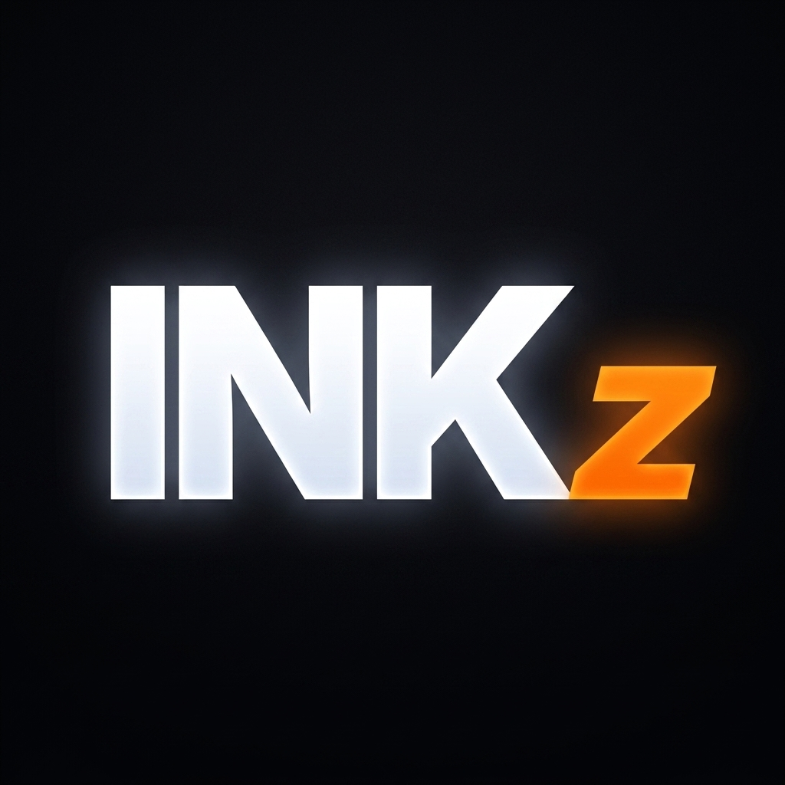
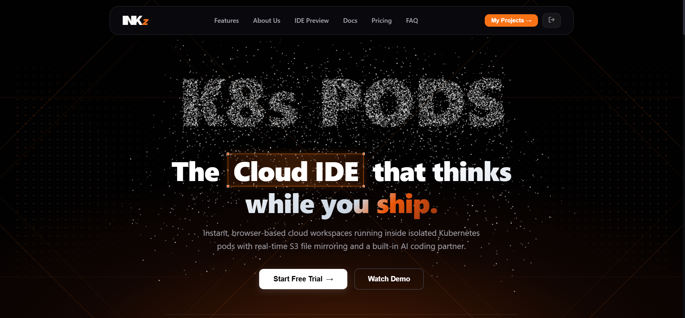
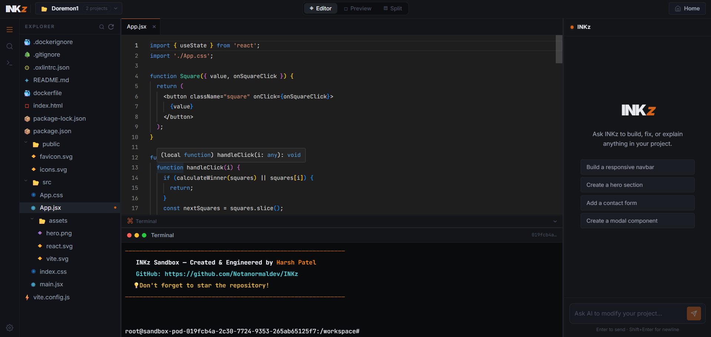
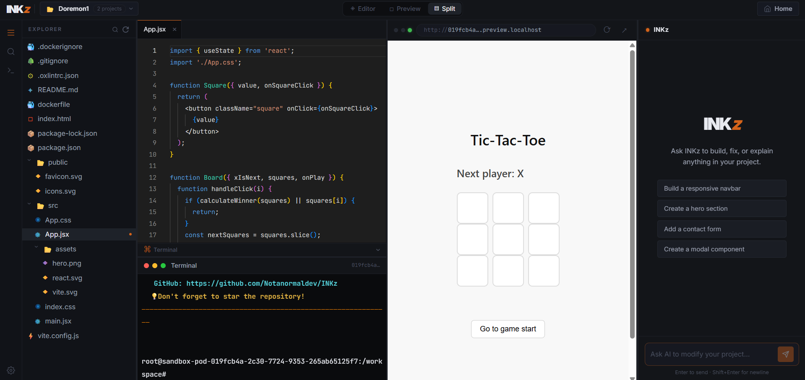
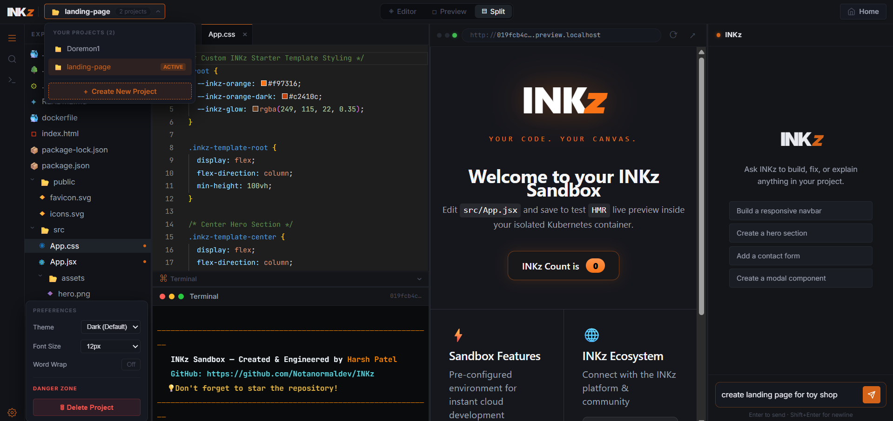
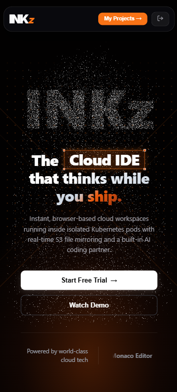
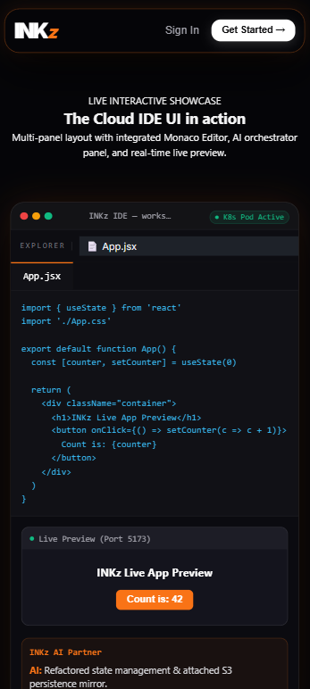

# ⚡ INKz

### The browser IS the IDE. The cloud IS the machine.

**An industrial-grade Cloud IDE & Agentic AI coding platform — 5 core microservices, 3 in-pod sidecars, 8 Docker images, running on real Kubernetes sandboxes, with an autonomous AI agent that ships code for you.**

[-1C3C3C.svg)](https://www.langchain.com/)

Built solo, top to bottom, by **[Harsh Patel](https://github.com/Notanormaldev)**

---

## Story behind INKz

Every developer knows the ritual: clone a repo, install the right Node version, pray the `.env` file is documented, fight a dependency conflict, and only then start actual work. INKz was built to kill that ritual entirely. Instead of setting up a machine, you open a tab — and a real, isolated Kubernetes pod is already waiting for you, running a VS Code-grade editor, a live terminal, and an AI agent that already understands your codebase.

This isn't a toy demo wrapped around a single API call. It's a full event-driven distributed system: five core microservices talk to each other over REST and an AMQP message bus, a Redis-backed state machine decides when your sandbox lives or dies, and three sidecar containers quietly keep every pod's filesystem, terminal, and AI access working in sync — all while staying invisible to the person actually writing code.

---

## See it in action

<table>
<tr>
<td width="50%"> <b>Platform overview</b></td>
<td width="50%"> <b>Monaco editor + live workspace explorer</b></td>
</tr>
<tr>
<td width="50%"> <b>Live dev server preview + HMR</b></td>
<td width="50%"> <b>Autonomous AI pair programmer</b></td>
</tr>
</table>

 <b>Mobile view</b> — the landing page and dashboard are fully responsive (the editor and AI agent are desktop-only)

---

## The numbers

| **8** | **5** | **3** | **3** | **20 min** |
|:---:|:---:|:---:|:---:|:---:|
| Docker images | Core microservices | In-pod sidecar containers | Isolated MongoDB databases | Auto pod cleanup via Redis TTL |

This isn't a wrapper around someone else's API. INKz provisions real Kubernetes pods for every developer, streams a real PTY terminal over WebSockets, mirrors every keystroke to S3, and runs a real LangChain ReAct agent with filesystem-level tool access to your sandbox — orchestrated across infrastructure that reads like a Series B platform team's, not a weekend project.

---

## What makes it click

| Feature | Powered by | What it actually does |
|---|---|---|
| **~4s sandbox boot** | Kubernetes + Docker | Isolated dev environments spin up in seconds, zero local config required |
| **Real-time S3 sync** | `chokidar` + AWS SDK | Continuous, bi-directional workspace mirroring — nothing is ever lost when a pod dies |
| **AI coding assistant** | LangChain ReAct agent | Full codebase context, autonomous multi-file edits, real terminal execution |
| **Browser IDE runtime** | Monaco + live HMR | True VS Code feel, with an integrated dev server preview and instant port forwarding |
| **Enterprise infrastructure** | Kubernetes + Redis | TTL-managed sandbox pods, heartbeat persistence, multi-tenant isolation baked into RBAC |

Every one of these is a real, working mechanism, not a marketing bullet — the ~4s boot is the actual pod scheduling time on a warmed node, the S3 sync is a live `chokidar` watcher with a 500ms write-stability threshold, and the AI agent genuinely reads, writes, and executes inside your live sandbox rather than guessing from a snippet you pasted in.

---

## What is INKz

No installs. No `node_modules` eating your disk. No "works on my machine." Open a URL and get a full VS Code-grade IDE, wired live to an isolated Kubernetes container that boots in seconds — with an AI coding partner sitting right next to you that can read your whole codebase and ship multi-file changes on command.

Develop on your laptop with Docker Desktop, then ship the exact same manifests to AWS EKS with one Skaffold profile switch. The architecture doesn't change between your machine and production — the same Kubernetes manifests, the same microservices, the same AI agent, just pointed at a bigger cluster.

---

## Architecture at a glance

INKz runs on 5 core microservices, each its own Dockerfile, each independently deployable and independently scalable:

| Service | What it does |
|---|---|
| **auth** | Google OAuth 2.0, JWT cookie issuance, early-access intake |
| **sandbox** | Talks to the Kubernetes API directly — the control plane that spins up, tracks, and tears down every developer's pod |
| **ai-orchestration** | Runs the LangChain agent — reads, writes, and refactors your code autonomously |
| **notification** | Consumes RabbitMQ events, fires transactional emails via Brevo |
| **router** | Subdomain-aware reverse proxy that beams your live dev server and terminal straight into the browser |

Inside every user's pod, 3 lightweight sidecars do the real-time work: `template` seeds the base workspace on first boot, `agent` exposes a file API the AI can act on, and `sync-agent` mirrors the filesystem to S3 as you type. They aren't top-level services — they're the muscle that makes each sandbox self-sufficient, and they live and die with the pod they belong to.

Kill any core service and the rest keep running. Auth goes down and sandboxes still boot; notification goes down and logins still succeed. That isolation isn't a README claim — it's the actual namespace and RBAC model underneath, backed by a Redis TTL lifecycle that reclaims idle pods automatically and a RabbitMQ event bus that keeps every service loosely coupled.

---

## AI that isn't locked to one vendor

The agent runs on Mistral by default, but the LangChain integration is fully pluggable — swap in Gemini 1.5 Pro, OpenAI, DeepSeek, Claude, or a 100% offline Ollama model with a single provider change in `ai-orchestration/src/agents/code.agent.js`. Bring your own key, bring your own model, bring your own cost profile. Nothing about the agent loop, its tools, or its access to your sandbox changes when you switch providers.

---

## Tech stack

Frontend to filesystem, every layer of INKz is real production tech — not toy tooling. React and Vite for the client, Monaco for the editor itself, Express and Socket.IO for the real-time layer, Kubernetes and Skaffold for orchestration, MongoDB/Redis/RabbitMQ for state and messaging, and LangChain sitting on top of a pluggable LLM backend.

---

## Self-host it, 100% free

Every cloud dependency in INKz has a zero-cost local swap — no AWS account, no managed database, no credit card:

| Cloud service | Free local swap |
|---|---|
| AWS S3 | MinIO (Docker) |
| MongoDB Atlas | `mongo:7` (Docker) |
| Redis Cloud | `redis:7` (Docker) |
| CloudAMQP | `rabbitmq:3-management` (Docker) |
| Any paid LLM API | Ollama, running fully offline |

Skip `auth` and `notification` entirely on an 8GB laptop to save roughly 2.5GB of RAM and still get sandboxes, editing, S3 sync, and the AI agent working end to end — the core loop doesn't need Google login or email to function.

---

## Go deeper

**Architecture Docs** — pod anatomy, the exact Redis TTL state machine, RabbitMQ event flow, LangChain tool loop, and request-by-request sequence diagrams.
**Self-Host Guide** — secrets explained one by one, MongoDB/Redis/RabbitMQ options, Ollama model picks by RAM, low-RAM mode, and the AWS EKS production path.
**DeepWiki** — an AI-generated, browsable map of the entire codebase if you want to explore the source without cloning it first.

---

## Built with 🔥 by Harsh Patel

Solo-built, end to end — frontend, five microservices, the Kubernetes control plane, and the AI agent that ties it all together.

If INKz impressed you even a little, a star tells me it's worth pushing further.

**MIT License**

